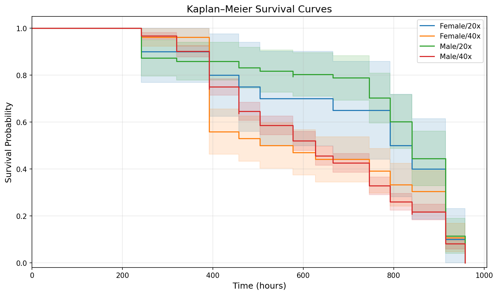
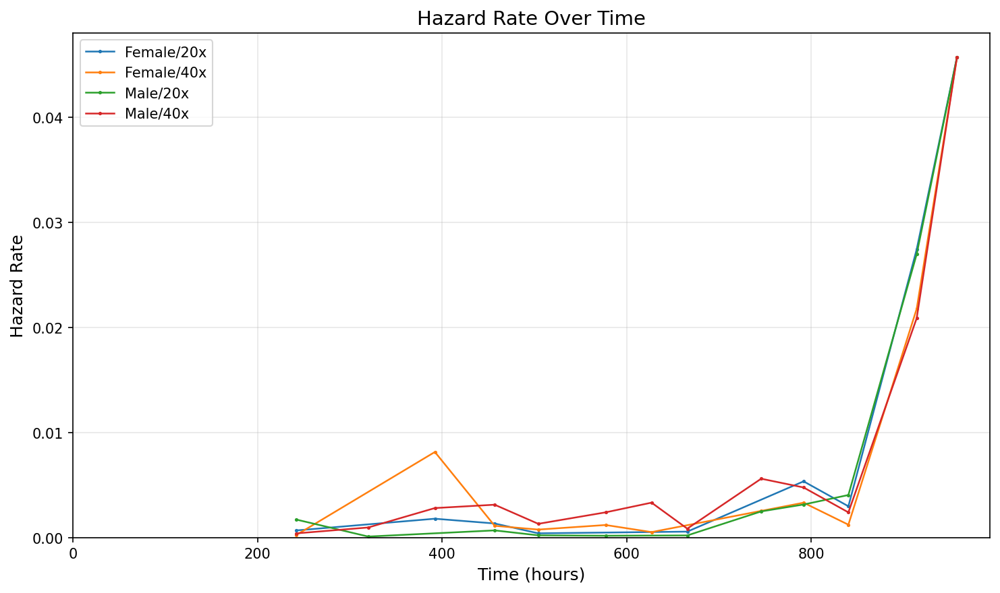
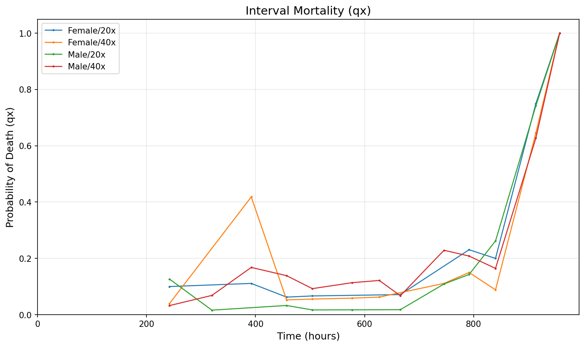
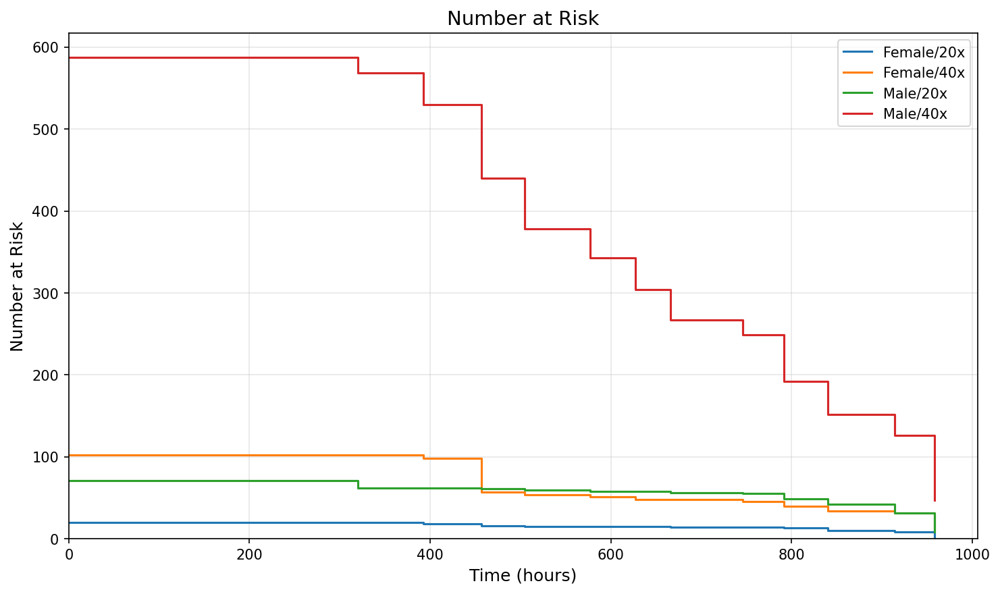

# Survival Analysis Report

**Input file:** `SampleDataSet.xlsx`  
**Treatment factors:** Sex, Density  
**Number of treatment groups:** 4  
**Total individuals:** 781  

## 1. Sample Summary

| Treatment | N | Deaths | Censored | % Censored |
|-----------|---|--------|----------|------------|
| Female/20x | 20 | 20 | 0 | 0.0% |
| Female/40x | 102 | 102 | 0 | 0.0% |
| Male/20x | 71 | 70 | 1 | 1.4% |
| Male/40x | 588 | 585 | 3 | 0.5% |

## 2. Survival Time Estimates

### Median Survival Time

| Treatment | Median Survival (hours) |
|-----------|------------------------|
| Female/20x | 791.8 |
| Female/40x | 504.2 |
| Male/20x | 840.3 |
| Male/40x | 627.0 |

### Restricted Mean Survival Time (RMST)

*Restricted to t = 958.1 hours (common max observed time)*

| Treatment | RMST (hours) |
|-----------|-------------|
| Female/20x | 436.2 |
| Female/40x | 331.1 |
| Male/20x | 490.1 |
| Male/40x | 356.7 |

### Lifespan by Treatment

| Treatment | N | Deaths | Mean (RMST) | Median | Top 10% Mean | Top 5% Mean |
|-----------|---|--------|-------------|--------|--------------|-------------|
| Female/20x | 20 | 20 | 666.0 | 791.8 | 958.0 | 958.0 |
| Female/40x | 102 | 102 | 568.3 | 504.2 | 958.0 | 958.0 |
| Male/20x | 71 | 70 | 716.7 | 840.3 | 958.0 | 958.0 |
| Male/40x | 588 | 585 | 594.7 | 627.0 | 949.2 | 958.0 |

### Lifespan by Factor Level (pooled)

| Factor Level | N | Deaths | Mean (RMST) | Median | Top 10% Mean | Top 5% Mean |
|--------------|---|--------|-------------|--------|--------------|-------------|
| Sex=Female | 122 | 122 | 586.6 | 627.0 | 958.0 | 958.0 |
| Sex=Male | 659 | 655 | 608.0 | 627.0 | 950.8 | 958.0 |
| Density=20x | 91 | 90 | 709.0 | 840.3 | 958.0 | 958.0 |
| Density=40x | 690 | 687 | 593.3 | 627.0 | 951.1 | 958.0 |

## 3. Kaplan–Meier Survival Curves

## 4. Hazard Rate Over Time

## 5. Interval Mortality (qx)

## 6. Number at Risk

## 7. Omnibus Log-Rank Test

- **Chi-square statistic:** 17.0283
- **Degrees of freedom:** 3
- **p-value:** 0.0007 ***

*The omnibus test indicates statistically significant differences in survival among the treatment groups.*

## 8. Pairwise Log-Rank Tests

| Comparison | Chi² | p-value | p (Bonferroni) | Sig. |
|------------|-------|---------|----------------|------|
| Female/20x vs Female/40x | 0.6736 | 0.4118 | 1.0000 | ns |
| Female/20x vs Male/20x | 0.2949 | 0.5871 | 1.0000 | ns |
| Female/20x vs Male/40x | 2.6020 | 0.1067 | 0.6404 | ns |
| Female/40x vs Male/20x | 4.5493 | 0.0329 | 0.1976 | ns |
| Female/40x vs Male/40x | 0.5958 | 0.4402 | 1.0000 | ns |
| Male/20x vs Male/40x | 15.8195 | 6.97e-05 | 0.0004 | *** |

## 9. Hazard Ratio Estimates

*Hazard ratios estimated from log-rank O/E method. HR > 1 indicates higher risk in the first group.*

| Comparison | HR | 95% CI |
|------------|-----|--------|
| Female/20x vs Female/40x | 0.855 | (0.542, 1.348) |
| Female/20x vs Male/20x | 1.111 | (0.666, 1.854) |
| Female/20x vs Male/40x | 0.737 | (0.500, 1.085) |
| Female/40x vs Male/20x | 1.293 | (0.958, 1.744) |
| Female/40x vs Male/40x | 0.934 | (0.760, 1.147) |
| Male/20x vs Male/40x | 0.661 | (0.534, 0.818) |

## 10. Lifetable (First 10 Rows per Treatment)

### Female/20x

| Time | n_at_risk | Deaths | Censored | lx | qx | px | hx | SE(KM) |
|------|-----------|--------|----------|-----|-----|-----|-----|--------|
| 241.9 | 20 | 2 | 0 | 0.9000 | 0.1000 | 0.9000 | 0.000701 | 0.0671 |
| 392.2 | 18 | 2 | 0 | 0.8000 | 0.1111 | 0.8889 | 0.001816 | 0.0894 |
| 456.9 | 16 | 1 | 0 | 0.7500 | 0.0625 | 0.9375 | 0.001364 | 0.0968 |
| 504.2 | 15 | 1 | 0 | 0.7000 | 0.0667 | 0.9333 | 0.000427 | 0.1025 |
| 665.7 | 14 | 1 | 0 | 0.6500 | 0.0714 | 0.9286 | 0.000588 | 0.1067 |
| 791.8 | 13 | 3 | 0 | 0.5000 | 0.2308 | 0.7692 | 0.005373 | 0.1118 |
| 840.3 | 10 | 2 | 0 | 0.4000 | 0.2000 | 0.8000 | 0.003002 | 0.1095 |
| 914.3 | 8 | 6 | 0 | 0.1000 | 0.7500 | 0.2500 | 0.027457 | 0.0671 |
| 958.1 | 2 | 2 | 0 | 0.0000 | 1.0000 | 0.0000 | 0.045761 | 0.0000 |

### Female/40x

| Time | n_at_risk | Deaths | Censored | lx | qx | px | hx | SE(KM) |
|------|-----------|--------|----------|-----|-----|-----|-----|--------|
| 241.9 | 102 | 4 | 0 | 0.9608 | 0.0392 | 0.9608 | 0.000266 | 0.0192 |
| 392.2 | 98 | 41 | 0 | 0.5588 | 0.4184 | 0.5816 | 0.008168 | 0.0492 |
| 456.9 | 57 | 3 | 0 | 0.5294 | 0.0526 | 0.9474 | 0.001143 | 0.0494 |
| 504.2 | 54 | 3 | 0 | 0.5000 | 0.0556 | 0.9444 | 0.000783 | 0.0495 |
| 577.2 | 51 | 3 | 0 | 0.4706 | 0.0588 | 0.9412 | 0.001218 | 0.0494 |
| 627.0 | 48 | 3 | 0 | 0.4412 | 0.0625 | 0.9375 | 0.000543 | 0.0492 |
| 745.8 | 45 | 5 | 0 | 0.3922 | 0.1111 | 0.8889 | 0.002560 | 0.0483 |
| 791.8 | 40 | 6 | 0 | 0.3333 | 0.1500 | 0.8500 | 0.003340 | 0.0467 |
| 840.3 | 34 | 3 | 0 | 0.3039 | 0.0882 | 0.9118 | 0.001247 | 0.0455 |
| 914.3 | 31 | 20 | 0 | 0.1078 | 0.6452 | 0.3548 | 0.021791 | 0.0307 |

### Male/20x

| Time | n_at_risk | Deaths | Censored | lx | qx | px | hx | SE(KM) |
|------|-----------|--------|----------|-----|-----|-----|-----|--------|
| 241.9 | 71 | 9 | 0 | 0.8732 | 0.1268 | 0.8732 | 0.001736 | 0.0395 |
| 319.9 | 62 | 1 | 0 | 0.8592 | 0.0161 | 0.9839 | 0.000119 | 0.0413 |
| 456.9 | 61 | 2 | 0 | 0.8310 | 0.0328 | 0.9672 | 0.000705 | 0.0445 |
| 504.2 | 59 | 1 | 0 | 0.8169 | 0.0169 | 0.9831 | 0.000234 | 0.0459 |
| 577.2 | 58 | 1 | 1 | 0.8028 | 0.0172 | 0.9828 | 0.000197 | 0.0472 |
| 665.7 | 56 | 1 | 0 | 0.7885 | 0.0179 | 0.9821 | 0.000225 | 0.0485 |
| 745.8 | 55 | 6 | 0 | 0.7025 | 0.1091 | 0.8909 | 0.002510 | 0.0545 |
| 791.8 | 49 | 7 | 0 | 0.6021 | 0.1429 | 0.8571 | 0.003169 | 0.0584 |
| 840.3 | 42 | 11 | 0 | 0.4444 | 0.2619 | 0.7381 | 0.004071 | 0.0594 |
| 914.3 | 31 | 23 | 0 | 0.1147 | 0.7419 | 0.2581 | 0.026987 | 0.0381 |

### Male/40x

| Time | n_at_risk | Deaths | Censored | lx | qx | px | hx | SE(KM) |
|------|-----------|--------|----------|-----|-----|-----|-----|--------|
| 241.9 | 588 | 19 | 0 | 0.9677 | 0.0323 | 0.9677 | 0.000421 | 0.0073 |
| 319.9 | 569 | 39 | 0 | 0.9014 | 0.0685 | 0.9315 | 0.000982 | 0.0123 |
| 392.2 | 530 | 89 | 1 | 0.7500 | 0.1679 | 0.8321 | 0.002830 | 0.0179 |
| 456.9 | 440 | 61 | 1 | 0.6460 | 0.1386 | 0.8614 | 0.003149 | 0.0197 |
| 504.2 | 378 | 35 | 0 | 0.5862 | 0.0926 | 0.9074 | 0.001330 | 0.0203 |
| 577.2 | 343 | 39 | 0 | 0.5196 | 0.1137 | 0.8863 | 0.002423 | 0.0206 |
| 627.0 | 304 | 37 | 0 | 0.4563 | 0.1217 | 0.8783 | 0.003346 | 0.0206 |
| 665.7 | 267 | 18 | 0 | 0.4256 | 0.0674 | 0.9326 | 0.000871 | 0.0204 |
| 745.8 | 249 | 57 | 0 | 0.3281 | 0.2289 | 0.7711 | 0.005624 | 0.0194 |
| 791.8 | 192 | 40 | 0 | 0.2598 | 0.2083 | 0.7917 | 0.004790 | 0.0181 |

---
*Report generated by pySurvAnalysis*
