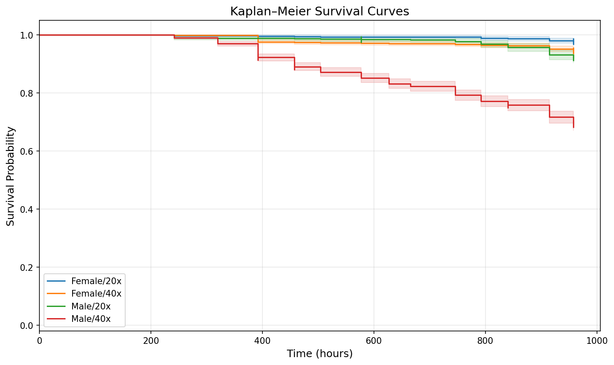
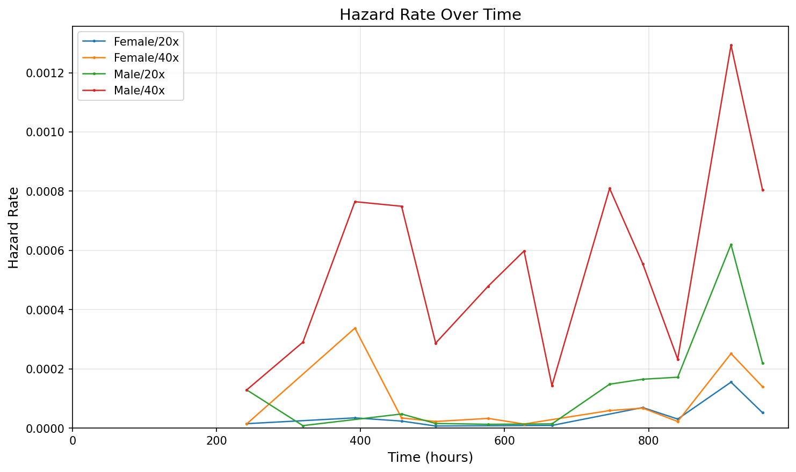
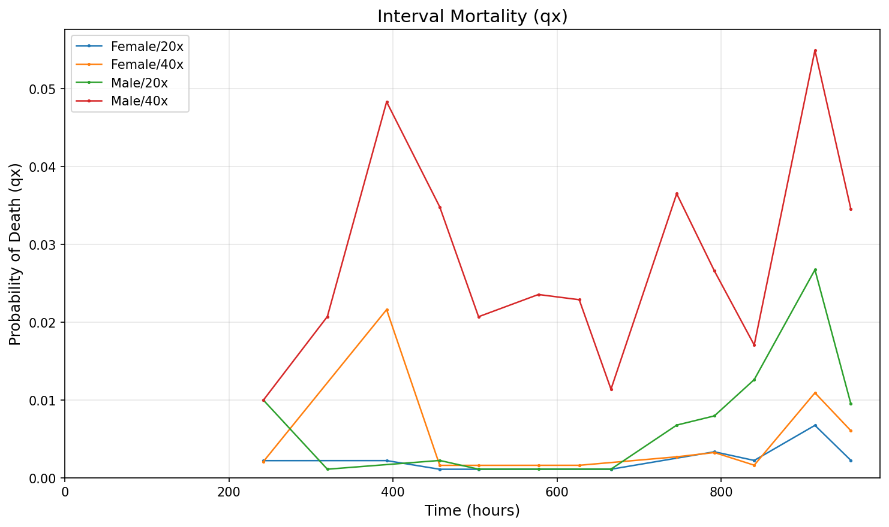
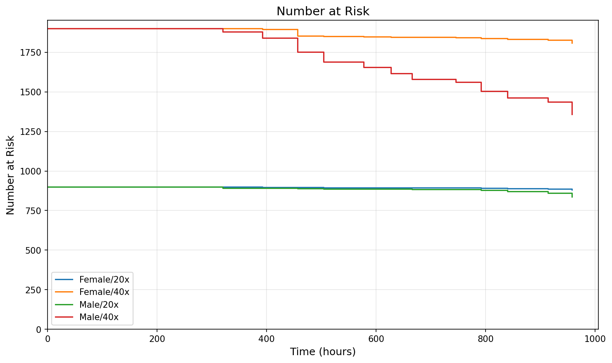
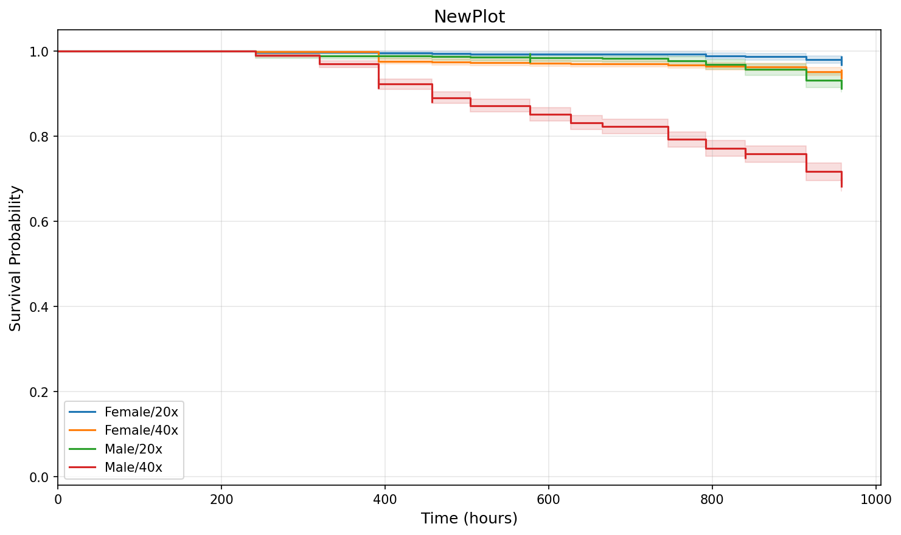

# Survival Analysis Report

**Input file:** `SampleDataSet.xlsx`  
**Treatment factors:** Sex, Density  
**Number of treatment groups:** 4  
**Total individuals:** 5600  
**Assume unobserved individuals censored:** Yes — unaccounted individuals added as right-censored at last census time  

## 1. Sample Summary

| Treatment | N | Deaths | Censored | % Censored |
|-----------|---|--------|----------|------------|
| Female/20x | 900 | 20 | 880 | 97.8% |
| Female/40x | 1900 | 102 | 1798 | 94.6% |
| Male/20x | 900 | 70 | 830 | 92.2% |
| Male/40x | 1900 | 585 | 1315 | 69.2% |

## 2. Survival Time Estimates

### Median Survival Time

| Treatment | Median Survival (hours) |
|-----------|------------------------|
| Female/20x | Not reached |
| Female/40x | Not reached |
| Male/20x | Not reached |
| Male/40x | Not reached |

### Restricted Mean Survival Time (RMST)

*Restricted to t = 958.1 hours (common max observed time)*

| Treatment | RMST (hours) |
|-----------|-------------|
| Female/20x | 709.9 |
| Female/40x | 695.4 |
| Male/20x | 698.4 |
| Male/40x | 605.1 |

### Lifespan by Treatment

| Treatment | N | Deaths | Mean (RMST) | Median |
|-----------|---|--------|-------------|--------|
| Female/20x | 900 | 20 | 951.6 | Not reached |
| Female/40x | 1900 | 102 | 937.1 | Not reached |
| Male/20x | 900 | 70 | 939.1 | Not reached |
| Male/40x | 1900 | 585 | 845.8 | Not reached |

### Lifespan by Factor Level (pooled)

| Factor Level | N | Deaths | Mean (RMST) | Median |
|--------------|---|--------|-------------|--------|
| Sex=Female | 2800 | 122 | 941.9 | Not reached |
| Sex=Male | 2800 | 655 | 875.9 | Not reached |
| Density=20x | 1800 | 90 | 945.5 | Not reached |
| Density=40x | 3800 | 687 | 891.9 | Not reached |

## 3. Kaplan–Meier Survival Curves

## 4. Hazard Rate Over Time

## 5. Interval Mortality (qx)

## 6. Number at Risk

## 7. Defined Plots (from DefinedPlots sheet)

Each plot below shows a subset of treatments as specified in the DefinedPlots sheet of the workbook.

### NewPlot

## 8. Omnibus Log-Rank Test

- **Chi-square statistic:** 740.8229
- **Degrees of freedom:** 3
- **p-value:** 0.00e+00 ***

*The omnibus test indicates statistically significant differences in survival among the treatment groups.*

## 9. Pairwise Log-Rank Tests

| Comparison | Chi² | p-value | p (Bonferroni) | Sig. |
|------------|-------|---------|----------------|------|
| Female/20x vs Female/40x | 14.4912 | 0.0001 | 0.0008 | *** |
| Female/20x vs Male/20x | 29.1758 | 6.61e-08 | 3.97e-07 | *** |
| Female/20x vs Male/40x | 281.3043 | 0.00e+00 | 0.00e+00 | *** |
| Female/40x vs Male/20x | 5.9431 | 0.0148 | 0.0886 | ns |
| Female/40x vs Male/40x | 416.4879 | 0.00e+00 | 0.00e+00 | *** |
| Male/20x vs Male/40x | 178.0097 | 0.00e+00 | 0.00e+00 | *** |

## 10. Hazard Ratio Estimates

*Hazard ratios estimated from log-rank O/E method. HR > 1 indicates higher risk in the first group.*

| Comparison | HR | 95% CI |
|------------|-----|--------|
| Female/20x vs Female/40x | 0.408 | (0.279, 0.596) |
| Female/20x vs Male/20x | 0.279 | (0.185, 0.422) |
| Female/20x vs Male/40x | 0.062 | (0.052, 0.073) |
| Female/40x vs Male/20x | 0.688 | (0.499, 0.947) |
| Female/40x vs Male/40x | 0.153 | (0.132, 0.178) |
| Male/20x vs Male/40x | 0.220 | (0.187, 0.258) |

## 11. Lifetable (First 10 Rows per Treatment)

### Female/20x

| Time | n_at_risk | Deaths | Censored | lx | qx | px | hx | SE(KM) |
|------|-----------|--------|----------|-----|-----|-----|-----|--------|
| 241.9 | 900 | 2 | 0 | 0.9978 | 0.0022 | 0.9978 | 0.000015 | 0.0016 |
| 392.2 | 898 | 2 | 0 | 0.9956 | 0.0022 | 0.9978 | 0.000034 | 0.0022 |
| 456.9 | 896 | 1 | 0 | 0.9944 | 0.0011 | 0.9989 | 0.000024 | 0.0025 |
| 504.2 | 895 | 1 | 0 | 0.9933 | 0.0011 | 0.9989 | 0.000007 | 0.0027 |
| 665.7 | 894 | 1 | 0 | 0.9922 | 0.0011 | 0.9989 | 0.000009 | 0.0029 |
| 791.8 | 893 | 3 | 0 | 0.9889 | 0.0034 | 0.9966 | 0.000069 | 0.0035 |
| 840.3 | 890 | 2 | 0 | 0.9867 | 0.0022 | 0.9978 | 0.000030 | 0.0038 |
| 914.3 | 888 | 6 | 0 | 0.9800 | 0.0068 | 0.9932 | 0.000155 | 0.0047 |
| 958.1 | 882 | 2 | 880 | 0.9778 | 0.0023 | 0.9977 | 0.000052 | 0.0049 |

### Female/40x

| Time | n_at_risk | Deaths | Censored | lx | qx | px | hx | SE(KM) |
|------|-----------|--------|----------|-----|-----|-----|-----|--------|
| 241.9 | 1900 | 4 | 0 | 0.9979 | 0.0021 | 0.9979 | 0.000014 | 0.0011 |
| 392.2 | 1896 | 41 | 0 | 0.9763 | 0.0216 | 0.9784 | 0.000338 | 0.0035 |
| 456.9 | 1855 | 3 | 0 | 0.9747 | 0.0016 | 0.9984 | 0.000034 | 0.0036 |
| 504.2 | 1852 | 3 | 0 | 0.9732 | 0.0016 | 0.9984 | 0.000022 | 0.0037 |
| 577.2 | 1849 | 3 | 0 | 0.9716 | 0.0016 | 0.9984 | 0.000033 | 0.0038 |
| 627.0 | 1846 | 3 | 0 | 0.9700 | 0.0016 | 0.9984 | 0.000014 | 0.0039 |
| 745.8 | 1843 | 5 | 0 | 0.9674 | 0.0027 | 0.9973 | 0.000059 | 0.0041 |
| 791.8 | 1838 | 6 | 0 | 0.9642 | 0.0033 | 0.9967 | 0.000067 | 0.0043 |
| 840.3 | 1832 | 3 | 0 | 0.9626 | 0.0016 | 0.9984 | 0.000022 | 0.0044 |
| 914.3 | 1829 | 20 | 0 | 0.9521 | 0.0109 | 0.9891 | 0.000252 | 0.0049 |

### Male/20x

| Time | n_at_risk | Deaths | Censored | lx | qx | px | hx | SE(KM) |
|------|-----------|--------|----------|-----|-----|-----|-----|--------|
| 241.9 | 900 | 9 | 0 | 0.9900 | 0.0100 | 0.9900 | 0.000129 | 0.0033 |
| 319.9 | 891 | 1 | 0 | 0.9889 | 0.0011 | 0.9989 | 0.000008 | 0.0035 |
| 456.9 | 890 | 2 | 0 | 0.9867 | 0.0022 | 0.9978 | 0.000048 | 0.0038 |
| 504.2 | 888 | 1 | 0 | 0.9856 | 0.0011 | 0.9989 | 0.000015 | 0.0040 |
| 577.2 | 887 | 1 | 1 | 0.9844 | 0.0011 | 0.9989 | 0.000013 | 0.0041 |
| 665.7 | 885 | 1 | 0 | 0.9833 | 0.0011 | 0.9989 | 0.000014 | 0.0043 |
| 745.8 | 884 | 6 | 0 | 0.9767 | 0.0068 | 0.9932 | 0.000148 | 0.0050 |
| 791.8 | 878 | 7 | 0 | 0.9689 | 0.0080 | 0.9920 | 0.000165 | 0.0058 |
| 840.3 | 871 | 11 | 0 | 0.9566 | 0.0126 | 0.9874 | 0.000172 | 0.0068 |
| 914.3 | 860 | 23 | 0 | 0.9311 | 0.0267 | 0.9733 | 0.000620 | 0.0084 |

### Male/40x

| Time | n_at_risk | Deaths | Censored | lx | qx | px | hx | SE(KM) |
|------|-----------|--------|----------|-----|-----|-----|-----|--------|
| 241.9 | 1900 | 19 | 0 | 0.9900 | 0.0100 | 0.9900 | 0.000129 | 0.0023 |
| 319.9 | 1881 | 39 | 0 | 0.9695 | 0.0207 | 0.9793 | 0.000290 | 0.0039 |
| 392.2 | 1842 | 89 | 1 | 0.9226 | 0.0483 | 0.9517 | 0.000764 | 0.0061 |
| 456.9 | 1752 | 61 | 1 | 0.8905 | 0.0348 | 0.9652 | 0.000749 | 0.0072 |
| 504.2 | 1690 | 35 | 0 | 0.8721 | 0.0207 | 0.9793 | 0.000287 | 0.0077 |
| 577.2 | 1655 | 39 | 0 | 0.8515 | 0.0236 | 0.9764 | 0.000479 | 0.0082 |
| 627.0 | 1616 | 37 | 0 | 0.8320 | 0.0229 | 0.9771 | 0.000598 | 0.0086 |
| 665.7 | 1579 | 18 | 0 | 0.8225 | 0.0114 | 0.9886 | 0.000143 | 0.0088 |
| 745.8 | 1561 | 57 | 0 | 0.7925 | 0.0365 | 0.9635 | 0.000809 | 0.0093 |
| 791.8 | 1504 | 40 | 0 | 0.7714 | 0.0266 | 0.9734 | 0.000555 | 0.0096 |

---
*Report generated by pySurvAnalysis*
